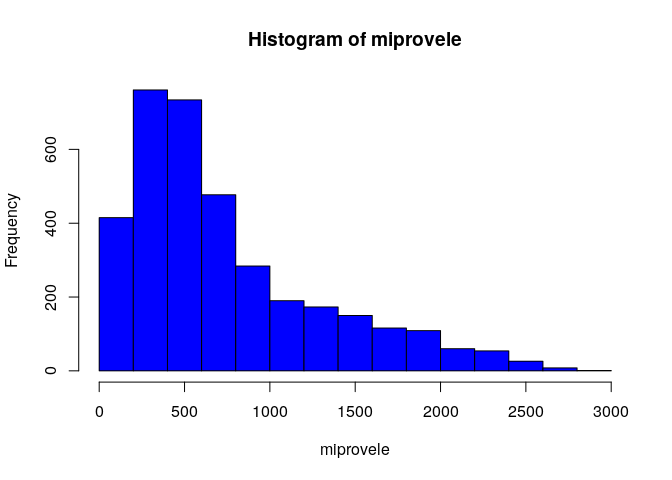

Unidad 1, asignación 2: exportar datos, leer ráster y extraer valores
=====================================================================

Sigo ayudando con `...`. Donde quiera que los veas, deberás sustituirlos por lo que indique el correspondiente mandato.

Dentro de las opciones de `knitr`, en el encabezado de este archivo, es probable que encuentres el argumento `eval = F`. Antes de tejer debes cambiarlo a `eval = T`, para que evalúe los bloques de código según tus cambios.

Provincia asignada
------------------

Toma nota del código de tu provincia asignada aleatoriamente.

``` r
 # abreviatura provaleatoria
 #       acade            11
 #       agrie            09
 #       aleir            10
 #       arqco            16
 #       cindy            12
 #       franc            23
 #       geora            08
 #       hoyod            22
 #       ingan            07
 #       ingdi            19
 #       itac9            15
 #       ivanv            25
 #       lbine            30
 #       leona            24
 #       magda            20
 #       maryj            02
 #       masue            26
 #       mmvol            13
 #       naui2            29
 #       rober            27
 #       wilne            06
 #       yoenn            21
```

Paquetes
--------

-   Carga el paquete `sf` y el paquete `raster`.

``` r
library(sf)
## Linking to GEOS 3.7.1, GDAL 2.4.2, PROJ 5.2.0
library(raster)
## Loading required package: sp
```

Exporta
-------

-   Determina el nombre de la capa provincias con `st_layers` del archivo GeoPackage que se encuentra en la carpeta `data`.

-   Carga la capa de provincias con la función `st_read`, asignándola al objeto `prov`.

-   Genera el objeto `miprov` que sólo contenga tu provincia.

-   Usando la función `st_write`, exporta el objeto `miprov` como GeoPackage a la carpeta `data` con el nombre `miprovexportado.gpkg`.

-   Lee el archivo exportado con la función `st_read` y asígnalo al objeto `miprovexportado`. Dado que sólo tiene una capa, no tienes que especificar el argumento `layer`.

-   Imprime en pantalla el objeto `miprovexportado` (sólo necesitas escribir el nombre del objeto).

``` r
st_layers('data/divisionRD.gpkg')
## Driver: GPKG 
## Available layers:
##      layer_name geometry_type features fields
## 1 PROVCenso2010       Polygon       32      4
## 2  MUNCenso2010       Polygon      155      5
## 3  REGCenso2010       Polygon       10      2
prov <- st_read(dsn = 'data/divisionRD.gpkg', layer = 'PROVCenso2010')
## Reading layer `PROVCenso2010' from data source `/home/ivanv/unidad-1-asignacion-2-rasters-y-exportar-datos-espaciales-Montaner32/data/divisionRD.gpkg' using driver `GPKG'
## Simple feature collection with 32 features and 4 fields
## geometry type:  MULTIPOLYGON
## dimension:      XY
## bbox:           xmin: 182215.8 ymin: 1933532 xmax: 571365.3 ymax: 2205216
## epsg (SRID):    32619
## proj4string:    +proj=utm +zone=19 +datum=WGS84 +units=m +no_defs
miprov <- prov[prov$PROV %in% '25', ]
st_write(obj = miprov, dsn = 'data/miprovexportado.gpkg', driver = 'GPKG')
## Updating layer `miprovexportado' to data source `data/miprovexportado.gpkg' using driver `GPKG'
## Updating existing layer miprovexportado
## Writing 1 features with 4 fields and geometry type Multi Polygon.
miprovexportado <- st_read(dsn = 'data/miprovexportado.gpkg')
## Reading layer `miprovexportado' from data source `/home/ivanv/unidad-1-asignacion-2-rasters-y-exportar-datos-espaciales-Montaner32/data/miprovexportado.gpkg' using driver `GPKG'
## Simple feature collection with 3 features and 4 fields
## geometry type:  MULTIPOLYGON
## dimension:      XY
## bbox:           xmin: 262657.3 ymin: 2104367 xmax: 337821 ymax: 2174094
## epsg (SRID):    32619
## proj4string:    +proj=utm +zone=19 +datum=WGS84 +units=m +no_defs
miprovexportado
## Simple feature collection with 3 features and 4 fields
## geometry type:  MULTIPOLYGON
## dimension:      XY
## bbox:           xmin: 262657.3 ymin: 2104367 xmax: 337821 ymax: 2174094
## epsg (SRID):    32619
## proj4string:    +proj=utm +zone=19 +datum=WGS84 +units=m +no_defs
##   PROV REG TOPONIMIA ENLACE                           geom
## 1   25  01  SANTIAGO   0125 MULTIPOLYGON (((337821 2158...
## 2   25  01  SANTIAGO   0125 MULTIPOLYGON (((337821 2158...
## 3   25  01  SANTIAGO   0125 MULTIPOLYGON (((337821 2158...
```

Ráster
------

-   Con la función `raster`, carga el modelo digital de elevaciones que se encuentra en la carpeta `data`. Es el único archivo de extensión `.tif` Asígnalo al objeto `mde`

-   Genera un mapa con la función `plot`, usando la paleta de colores `terrain.colors`.

``` r
mde <- raster('data/mde_rd.tif')
plot(mde, col = terrain.colors(n = 255))
```


Extraer valores del ráster
--------------------------

-   Con la función `raster::extract`, extrae los valores de elevación correspondientes a tu provincia. Utiliza `mde` como objeto ráster y `miprov` como capa zonal. Asigna los valores al objeto `miprovele`.

-   Imprime en pantalla el objeto `miprovele` (sólo necesitas escribir el nombre del objeto).

-   Obtén los estadísticos descriptivos básicos (mínimo, primer cuartil, media, mediana, tercer cuartil, máximo) de `miprovele` con la función `summary`.

-   Genera un histograma de `miprovele` usando la función `hist`.

``` r
miprovele <- raster::extract(mde, miprov)[[1]]
miprovele
##    [1]  745.08  710.91  657.10  599.73  554.53  558.48  668.95  606.10
##    [9]  500.66  495.07  481.13  425.37  492.19  560.93  503.43  484.86
##   [17]  509.83  586.21  637.42  460.22  412.08  398.28  303.91  353.33
##   [25]  442.96  524.79  422.48  425.92  486.85  522.63  501.44  547.67
##   [33]  607.36  783.34  637.95  401.60  394.07  450.89  272.47  344.12
##   [41]  383.92  431.41  416.96  371.39  512.86  490.37  438.96  471.66
##   [49]  541.45  666.56  765.90  486.84  438.68  492.46  432.17  499.46
##   [57]  519.29  671.96  244.59  290.14  349.05  398.13  474.31  375.28
##   [65]  482.08  496.37  392.36  436.85  498.00  598.64  785.29  666.02
##   [73]  535.28  434.99  545.71  541.35  490.88  589.99  743.56  803.13
##   [81]  216.73  244.32  298.99  329.31  359.87  317.70  357.33  352.82
##   [89]  388.27  445.83  511.40  605.38  677.30  678.42  552.66  509.38
##   [97]  505.20  563.35  487.56  570.25  703.11  689.41  184.08  200.39
##  [105]  231.04  261.64  277.24  283.56  362.42  329.46  418.34  545.13
##  [113]  598.28  598.87  569.39  667.64  794.78 1046.68  773.42  742.86
##  [121]  721.45  672.60  653.10  495.86  540.01  502.06  477.11  524.21
##  [129]  581.75  131.26  159.56  171.23  195.94  213.82  236.72  291.66
##  [137]  320.04  303.33  492.59  652.43  736.60  638.23  510.88  681.16
##  [145]  864.36 1057.54  867.71  709.55  665.88  655.51  704.16  604.61
##  [153]  594.21  525.73  580.49  550.20  527.05  532.39  127.11  131.32
##  [161]  135.68  143.85  162.10  182.08  204.18  212.78  266.17  311.56
##  [169]  450.77  486.72  511.01  525.08  484.61  703.96  787.10  969.51
##  [177] 1096.20  891.75  742.76  761.62  628.54  656.55  737.58  765.71
##  [185]  823.31  655.24  576.72  671.95  601.05  587.76  108.39  112.19
##  [193]  118.56  126.06  130.10  136.67  147.09  157.36  168.64  226.82
##  [201]  254.59  237.90  279.77  306.97  302.71  320.55  415.04  506.00
##  [209]  556.57  635.95  739.80  857.54  802.98  676.85  575.20  546.72
##  [217]  687.14  837.94  836.43  799.46  698.10  783.15  754.67  638.91
##  [225]   87.52   90.38   97.69  102.89  111.32  122.77  125.32  138.05
##  [233]  142.87  149.25  170.28  196.71  213.18  199.54  190.79  184.98
##  [241]  211.22  256.12  262.38  296.68  348.50  387.46  490.91  632.32
##  [249]  732.30  766.89  631.55  463.50  601.23  720.62  683.99  724.38
##  [257]  727.56  723.16  826.66  693.58   86.22   85.54   87.67   95.18
##  [265]  107.42  117.57  130.22  135.95  141.65  163.47  170.52  181.21
##  [273]  174.93  166.46  166.70  183.18  203.56  206.78  194.16  213.41
##  [281]  233.14  323.47  401.56  541.11  627.91  678.65  487.90  407.96
##  [289]  565.25  629.59  633.67  601.24  556.40  716.99  802.69   91.05
##  [297]   97.85  109.13  122.74  128.75  143.77  141.02  143.30  146.25
##  [305]  143.58  149.56  161.49  174.57  178.56  173.56  167.08  167.15
##  [313]  198.00  267.63  330.33  396.41  448.58  401.73  491.93  469.97
##  [321]  466.74  566.10  485.95  542.09  676.01  690.85  693.02  789.35
##  [329]  106.84  104.48   98.14   97.53  100.21  108.87  116.74  124.16
##  [337]  125.23  129.10  135.72  143.08  152.83  155.39  152.96  150.48
##  [345]  151.08  163.87  181.17  212.05  247.61  282.40  334.88  439.59
##  [353]  418.22  504.56  441.14  412.12  509.48  624.90  603.57  689.21
##  [361]  741.10  685.16  645.89  750.13  830.77  953.01  120.84  116.03
##  [369]  121.62  112.57  101.86  100.11  104.20  108.70  109.07  111.38
##  [377]  117.96  127.15  134.95  139.19  137.35  140.29  149.79  161.51
##  [385]  175.11  193.12  213.33  235.06  253.21  298.75  441.91  448.31
##  [393]  378.30  441.81  543.53  535.84  511.36  619.63  649.92  593.51
##  [401]  530.35  546.33  609.94  757.64  878.45  134.84  129.95  136.10
##  [409]  119.55  120.67  105.53  112.43  102.33  104.47  107.65  108.17
##  [417]  112.89  123.48  129.69  133.21  138.39  147.60  159.94  173.07
##  [425]  187.11  195.82  207.00  217.74  235.02  291.70  317.65  412.44
##  [433]  479.78  464.07  449.66  454.45  565.81  579.31  518.76  482.72
##  [441]  501.42  550.34  618.90  690.16  797.31  139.16  146.25  154.34
##  [449]  135.29  135.92  133.39  123.89  119.35  110.94  106.53  107.87
##  [457]  109.70  112.41  115.81  124.46  133.66  141.13  148.47  158.83
##  [465]  168.32  178.75  186.43  193.70  201.17  212.34  226.44  248.36
##  [473]  314.57  398.70  392.67  417.26  516.96  507.86  474.17  438.27
##  [481]  407.47  433.18  537.76  536.58  590.81  666.45  713.33  151.96
##  [489]  165.39  159.62  155.07  149.43  145.91  136.41  130.41  133.16
##  [497]  120.84  112.67  111.65  114.29  114.57  120.94  132.90  140.47
##  [505]  146.44  152.54  162.31  170.34  176.91  189.91  199.21  207.60
##  [513]  212.55  230.78  254.20  291.80  323.90  369.23  384.54  384.62
##  [521]  396.30  378.03  386.34  452.52  514.44  493.86  485.90  553.09
##  [529]  585.44  191.42  172.62  182.83  178.04  167.83  161.88  159.02
##  [537]  152.20  143.43  139.97  143.90  140.49  131.27  129.01  128.10
##  [545]  121.50  128.93  137.79  144.95  149.90  159.21  170.46  169.32
##  [553]  182.16  192.66  198.22  207.39  223.02  242.84  260.71  269.87
##  [561]  282.64  297.28  312.02  348.31  335.40  393.15  389.40  395.56
##  [569]  441.25  415.71  418.05  477.91  274.85  237.95  226.43  211.18
##  [577]  194.48  174.78  173.05  164.77  156.22  154.93  155.02  153.59
##  [585]  145.07  141.92  139.31  126.36  124.40  147.86  146.78  155.21
##  [593]  162.50  171.88  176.35  180.18  188.88  201.17  205.55  217.69
##  [601]  231.73  244.64  250.98  250.71  262.60  268.83  276.81  290.16
##  [609]  314.46  325.66  342.54  358.89  361.90  288.20  344.91  290.12
##  [617]  234.18  190.81  187.29  180.33  173.74  171.44  169.47  161.83
##  [625]  154.56  150.26  148.02  134.56  127.03  134.25  159.88  178.47
##  [633]  185.41  176.91  174.80  191.04  200.96  195.57  199.44  211.68
##  [641]  221.56  232.29  237.70  238.09  245.07  251.26  257.21  256.87
##  [649]  258.65  270.69  285.62  345.95  291.05  390.82  315.60  246.56
##  [657]  213.53  207.10  192.72  195.41  187.23  178.90  166.95  161.42
##  [665]  160.80  146.24  132.07  144.23  175.76  183.30  187.87  163.43
##  [673]  159.58  170.49  178.01  189.72  202.73  219.98  217.30  223.14
##  [681]  227.28  228.58  232.58  239.72  244.10  244.86  239.57  241.61
##  [689]  248.92  134.00  246.55  339.97  344.14  373.77  276.79  242.56
##  [697]  297.82  268.08  213.78  206.96  198.53  187.43  178.55  180.05
##  [705]  164.82  150.47  142.60  163.29  166.95  168.72  149.19  149.43
##  [713]  156.73  172.87  184.48  211.93  229.84  214.86  216.15  216.85
##  [721]  220.60  224.81  228.29  231.31  233.51  231.20  235.73  236.36
##  [729]  137.67  158.46  196.67  273.33  319.92  181.55  277.09  174.03
##  [737]  242.76  272.46  282.32  273.92  296.14  381.68  343.79  293.23
##  [745]  230.06  217.13  205.51  192.70  182.89  168.44  166.98  141.48
##  [753]  144.68  147.37  146.45  148.47  155.35  161.35  176.24  196.28
##  [761]  210.72  211.30  206.99  206.02  208.32  213.26  216.22  218.01
##  [769]  220.14  222.99  222.26  225.45  228.01  185.71  206.57  244.12
##  [777]  261.17  303.52  272.44  230.60  182.49  220.54  156.75  168.99
##  [785]  177.43  280.59  350.46  373.70  398.16  421.50  437.11  404.07
##  [793]  401.86  420.65  427.83  455.71  411.07  323.43  257.55  239.11
##  [801]  217.69  210.28  190.05  176.91  161.67  166.89  162.60  161.73
##  [809]  173.06  169.44  190.85  169.23  178.56  204.15  206.44  199.64
##  [817]  197.87  200.71  204.52  206.29  207.08  209.00  209.94  213.28
##  [825]  210.88  216.28  215.46  186.57  209.79  230.98  278.33  293.13
##  [833]  254.43  231.84  213.52  199.63  206.86  270.68  221.80  183.25
##  [841]  177.35  185.64  216.48  244.96  298.76  385.37  420.53  439.53
##  [849]  440.68  465.31  492.12  493.10  469.34  449.82  431.85  417.57
##  [857]  324.78  296.37  266.29  238.57  218.93  196.32  180.12  170.45
##  [865]  174.30  187.30  189.40  188.98  192.89  194.85  184.78  169.53
##  [873]  179.95  193.39  188.03  194.41  198.25  198.26  198.55  200.02
##  [881]  200.98  201.58  205.39  203.81  204.00  166.36  217.75  232.78
##  [889]  249.15  277.07  257.24  245.18  242.52  217.03  207.68  246.39
##  [897]  232.40  197.19  174.84  178.52  202.80  201.29  235.98  252.67
##  [905]  312.18  393.28  420.65  416.01  453.46  448.60  458.78  475.01
##  [913]  466.40  431.73  414.82  450.98  430.33  308.69  250.86  223.08
##  [921]  205.73  192.11  188.61  181.85  187.69  209.72  208.52  202.40
##  [929]  197.64  191.25  167.68  199.25  195.51  195.03  203.16  212.32
##  [937]  200.70  193.31  191.93  192.42  195.65  197.75  199.80  178.57
##  [945]  255.48  266.20  297.15  318.83  302.90  263.48  221.47  237.55
##  [953]  249.86  232.64  210.16  181.77  183.24  205.40  232.76  238.54
##  [961]  284.41  354.74  344.64  374.53  372.98  398.34  428.23  454.59
##  [969]  466.38  456.81  448.13  414.95  437.07  450.39  379.97  292.18
##  [977]  236.48  213.51  201.60  203.31  191.98  197.72  223.57  242.67
##  [985]  229.08  202.11  177.93  186.82  214.14  218.82  210.92  218.83
##  [993]  221.83  202.87  189.04  185.70  186.20  187.44  189.15  190.65
## [1001]  186.84  241.63  226.32  222.97  219.05  247.37  279.04  335.97
## [1009]  347.23  329.52  310.47  315.53  306.70  283.55  264.48  238.50
## [1017]  218.43  176.98  181.97  228.58  239.21  265.23  263.00  301.46
## [1025]  315.79  322.33  339.59  383.54  432.67  464.03  469.75  451.16
## [1033]  426.40  399.00  407.82  387.78  390.82  352.03  260.52  237.62
## [1041]  223.34  214.34  200.62  227.78  251.43  240.50  222.13  198.02
## [1049]  191.86  212.95  224.01  237.13  233.20  240.19  224.04  199.13
## [1057]  188.10  181.14  180.40  180.83  181.86  182.78  179.65  286.37
## [1065]  285.75  309.87  294.12  272.27  329.74  314.98  377.85  348.96
## [1073]  335.03  323.53  351.71  372.92  367.68  337.74  301.77  240.24
## [1081]  201.99  200.10  204.02  190.10  223.41  261.18  294.45  292.24
## [1089]  315.12  340.52  343.10  377.76  435.83  477.61  453.39  438.08
## [1097]  413.96  390.23  364.45  375.37  376.58  285.86  248.06  245.66
## [1105]  218.95  222.89  246.84  246.20  233.55  237.00  197.05  211.92
## [1113]  263.28  248.45  250.42  244.93  233.36  213.32  200.61  189.89
## [1121]  179.26  174.21  175.65  175.47  176.46  173.32  290.57  337.72
## [1129]  350.49  376.48  348.51  367.94  408.98  384.41  386.89  382.22
## [1137]  397.63  410.12  434.12  449.09  414.31  367.43  330.55  279.53
## [1145]  300.71  238.06  206.49  211.89  258.52  264.67  291.64  301.63
## [1153]  340.27  377.82  378.61  427.40  450.65  431.80  428.91  416.11
## [1161]  412.13  400.50  382.35  367.47  330.09  300.60  231.43  225.93
## [1169]  264.07  251.84  252.97  230.53  215.88  193.89  228.13  284.75
## [1177]  256.16  265.73  246.67  229.21  216.78  204.32  193.36  182.09
## [1185]  173.79  169.90  170.02  169.59  167.03  247.50  244.33  233.22
## [1193]  296.55  343.03  317.90  386.21  415.38  457.21  444.34  468.44
## [1201]  465.56  465.45  465.49  483.29  502.35  512.71  441.25  412.07
## [1209]  406.07  396.20  367.45  293.68  310.66  323.29  309.46  291.21
## [1217]  324.08  334.03  329.88  359.41  402.24  438.55  458.08  449.26
## [1225]  441.32  456.78  439.15  456.52  458.18  429.12  403.42  360.92
## [1233]  242.51  250.60  279.00  270.36  254.61  232.09  216.88  193.02
## [1241]  237.15  271.63  273.35  279.24  268.37  240.25  226.44  209.39
## [1249]  192.20  185.09  178.64  171.55  163.54  164.02  163.93  330.19
## [1257]  377.95  325.89  270.86  367.79  305.63  249.93  305.37  345.66
## [1265]  368.04  349.97  443.83  512.20  527.42  517.23  494.22  518.19
## [1273]  535.26  530.10  537.35  514.91  498.69  484.28  473.34  447.90
## [1281]  353.25  331.97  377.12  407.53  396.96  363.43  363.02  380.77
## [1289]  383.04  355.53  407.60  439.43  476.69  477.86  475.59  467.09
## [1297]  461.80  450.41  407.74  359.52  336.70  267.80  311.67  327.92
## [1305]  291.81  274.43  260.85  244.62  241.04  204.85  226.79  269.21
## [1313]  292.82  290.00  302.42  266.86  240.59  222.07  201.51  192.80
## [1321]  184.54  174.25  165.91  357.15  360.74  445.08  463.65  524.43
## [1329]  398.77  281.17  305.53  364.77  418.19  420.96  298.45  369.36
## [1337]  369.54  379.89  381.02  465.63  529.35  548.74  545.51  540.45
## [1345]  537.89  522.00  524.39  533.96  516.45  491.69  506.82  476.11
## [1353]  397.28  443.14  450.15  440.43  463.04  441.10  430.72  422.69
## [1361]  424.22  387.81  409.46  426.20  478.13  504.76  479.89  457.07
## [1369]  434.23  420.65  398.05  416.55  413.00  299.36  311.95  381.71
## [1377]  315.10  299.57  291.49  278.50  301.55  271.12  235.59  230.07
## [1385]  276.05  331.60  312.23  328.03  314.47  274.13  245.62  220.07
## [1393]  201.53  188.21  175.52  436.60  510.22  559.84  569.94  453.45
## [1401]  399.19  382.02  382.62  494.54  517.74  454.24  310.15  447.22
## [1409]  473.10  439.06  403.94  430.18  526.56  537.93  540.27  511.61
## [1417]  484.22  445.09  477.40  453.89  424.99  420.55  507.79  509.11
## [1425]  447.21  512.50  486.93  486.81  478.14  483.02  486.47  498.72
## [1433]  443.60  449.40  464.72  431.84  508.63  505.65  466.10  442.55
## [1441]  414.88  387.68  368.06  349.78  319.40  306.03  351.58  405.92
## [1449]  386.05  341.21  285.69  298.75  299.69  317.45  283.08  292.72
## [1457]  380.30  394.24  323.95  348.44  307.79  266.63  241.44  224.46
## [1465]  430.74  545.02  531.82  609.39  605.83  504.29  505.66  466.72
## [1473]  407.06  475.84  568.22  533.43  359.70  334.53  496.59  485.86
## [1481]  512.14  526.81  534.81  518.23  484.24  467.20  446.94  433.40
## [1489]  412.11  400.11  402.58  412.30  387.37  389.43  492.42  521.39
## [1497]  527.27  510.51  496.12  508.04  525.94  495.69  512.45  490.75
## [1505]  515.91  467.56  520.64  510.66  477.55  465.65  428.26  419.53
## [1513]  417.56  387.78  339.81  358.04  408.45  437.57  381.38  324.70
## [1521]  307.49  340.29  340.41  324.95  262.40  329.67  341.87  381.64
## [1529]  363.07  335.81  296.56  259.60  247.99  231.57  424.65  583.79
## [1537]  592.89  729.20  677.04  611.10  582.47  568.59  509.62  512.27
## [1545]  560.69  574.67  478.14  356.48  543.80  566.41  580.08  567.55
## [1553]  566.67  539.26  526.03  473.48  434.97  429.64  415.07  423.66
## [1561]  418.65  381.40  357.49  364.63  418.91  483.07  512.63  539.87
## [1569]  523.55  536.67  535.46  540.48  535.91  532.08  526.63  529.34
## [1577]  557.18  529.73  472.31  484.57  440.39  441.25  394.12  366.64
## [1585]  410.01  427.82  466.14  452.36  404.12  331.66  335.75  376.10
## [1593]  361.10  272.57  220.12  261.30  343.01  358.15  364.34  314.39
## [1601]  282.50  291.12  280.81  438.97  596.43  644.31  748.37  753.93
## [1609]  639.13  590.56  564.93  638.86  589.10  559.55  566.60  518.05
## [1617]  407.35  552.86  659.89  611.58  583.43  593.51  594.83  584.80
## [1625]  532.06  455.56  481.06  483.08  456.67  438.05  387.29  368.02
## [1633]  374.94  419.57  463.47  506.53  523.74  523.37  545.38  531.21
## [1641]  549.25  546.46  563.06  563.03  574.05  542.75  500.78  519.30
## [1649]  492.20  476.19  458.24  425.09  414.07  462.69  469.94  451.55
## [1657]  473.83  422.24  399.13  347.88  330.31  306.77  288.93  256.32
## [1665]  242.03  350.05  392.90  390.90  340.07  313.75  293.92  506.94
## [1673]  558.23  524.72  673.03  700.13  826.54  783.81  666.27  604.54
## [1681]  599.37  695.11  694.17  657.89  574.54  440.03  481.39  490.12
## [1689]  658.03  651.00  611.67  677.14  652.06  529.03  520.82  503.52
## [1697]  603.29  579.52  511.27  538.86  481.88  419.12  399.06  408.76
## [1705]  401.54  412.13  461.40  490.03  524.22  538.10  554.46  551.80
## [1713]  586.38  601.83  594.26  559.50  534.58  532.88  515.07  501.73
## [1721]  471.04  444.26  443.80  454.24  427.70  422.87  423.85  434.64
## [1729]  373.76  339.81  327.49  287.45  251.88  228.83  269.58  340.53
## [1737]  404.32  421.05  365.19  330.94  502.30  542.91  621.05  515.20
## [1745]  582.44  627.07  705.30  716.75  696.97  711.44  646.28  690.51
## [1753]  729.15  725.43  523.77  427.75  533.74  546.01  600.69  713.15
## [1761]  656.84  775.87  784.84  596.62  566.02  527.02  562.77  630.52
## [1769]  618.27  512.38  474.33  510.86  524.08  532.23  482.26  462.31
## [1777]  458.15  461.77  469.92  532.28  571.16  576.18  561.03  550.93
## [1785]  533.24  535.44  499.54  480.48  484.67  454.22  450.06  406.74
## [1793]  403.72  428.55  393.60  370.39  357.74  346.72  300.34  266.61
## [1801]  270.85  264.96  254.90  255.74  252.84  300.31  376.74  438.74
## [1809]  390.07  550.85  616.16  569.32  613.83  674.01  782.41  782.98
## [1817]  735.75  785.13  737.63  682.10  674.76  684.61  543.05  530.26
## [1825]  696.52  777.74  770.52  751.54  745.48  775.42  772.42  583.52
## [1833]  619.39  645.68  653.66  665.23  587.44  581.19  609.22  587.94
## [1841]  571.26  549.68  495.96  492.76  569.17  562.20  542.37  525.68
## [1849]  576.57  589.59  559.16  520.74  508.70  501.80  476.92  457.35
## [1857]  435.81  418.95  419.75  402.03  381.65  412.58  406.56  414.26
## [1865]  385.70  349.98  302.93  262.35  279.19  295.47  305.27  312.66
## [1873]  266.89  285.65  346.72  385.14  425.40  550.61  649.61  645.89
## [1881]  671.16  712.32  817.61  758.81  704.14  695.55  677.05  648.36
## [1889]  635.83  653.47  625.08  616.23  842.26  832.23  839.88  864.25
## [1897]  726.65  666.96  705.36  635.92  565.92  684.89  740.96  752.56
## [1905]  611.74  672.41  644.78  606.88  563.60  547.09  561.25  484.48
## [1913]  570.44  594.05  595.87  585.17  607.35  571.74  557.45  545.49
## [1921]  553.20  563.28  523.47  491.84  494.93  493.90  473.39  501.50
## [1929]  430.64  362.67  339.84  359.70  353.24  335.41  333.65  323.05
## [1937]  312.20  353.69  343.57  287.33  302.16  381.04  349.32  364.06
## [1945]  417.70  642.79  730.74  754.47  744.76  868.95  912.47  816.83
## [1953]  775.51  712.58  665.66  658.85  689.54  610.45  533.29  692.69
## [1961]  872.75  824.51  757.01  740.56  764.44  695.94  674.63  757.54
## [1969]  590.76  706.72  891.60  907.30  743.43  758.82  656.02  610.17
## [1977]  596.75  598.14  574.88  510.79  548.01  591.65  631.50  619.93
## [1985]  598.33  587.14  608.46  587.35  603.26  609.78  577.44  564.20
## [1993]  549.61  502.71  471.94  442.94  392.98  356.93  393.80  391.21
## [2001]  359.81  345.91  342.26  340.03  349.44  361.82  330.87  278.26
## [2009]  328.63  367.64  371.52  348.13  395.48  704.55  778.48  855.20
## [2017]  873.70  915.10  839.53  800.59  784.05  770.16  820.70  776.72
## [2025]  587.36  554.88  667.66  713.61  813.23  948.84  826.71  725.22
## [2033]  741.92  777.84  662.99  681.69  619.78  736.76  817.55  950.91
## [2041]  816.34  852.93  725.46  647.84  645.41  629.83  559.87  517.19
## [2049]  583.68  621.00  649.02  646.53  625.64  623.22  605.55  618.48
## [2057]  607.26  601.69  548.90  461.72  458.99  460.48  449.45  427.96
## [2065]  435.10  407.09  400.27  381.97  335.29  351.46  351.91  330.62
## [2073]  370.60  392.67  335.71  386.61  417.65  389.67  389.47  720.79
## [2081]  861.56  988.10 1088.19  982.64  955.25  941.67  918.06  932.86
## [2089]  977.34  776.76  696.46  740.72  759.88  864.43  886.43  983.37
## [2097]  816.31  751.78  708.02  809.17  850.14  715.61  763.67  890.91
## [2105]  870.50  916.06  853.65  896.10  745.38  657.12  631.55  610.75
## [2113]  592.10  569.78  625.11  652.80  681.04  684.13  662.12  648.02
## [2121]  592.70  581.07  525.69  499.69  472.37  491.80  522.90  608.04
## [2129]  575.03  482.72  464.75  478.33  420.48  386.44  368.89  393.54
## [2137]  366.26  345.85  372.74  371.41  342.25  434.12  448.55  740.11
## [2145]  896.46 1162.00 1220.07 1204.49 1150.90 1148.50 1128.52 1062.01
## [2153]  922.49  736.62  853.03  944.57  941.60  992.97  962.25  852.76
## [2161]  940.45  887.93  785.61  721.61  757.52  810.65  924.15 1004.08
## [2169] 1114.28 1085.92  931.15  926.99  814.88  766.99  689.62  717.09
## [2177]  665.67  621.01  638.61  668.02  702.95  710.73  686.42  655.87
## [2185]  588.90  508.61  519.49  496.73  554.35  652.10  624.90  567.44
## [2193]  506.13  429.67  548.80  642.68  620.42  580.90  459.88  494.00
## [2201]  439.85  384.77  356.32  396.99  345.86  762.38  920.11 1202.26
## [2209] 1410.34 1504.40 1469.39 1365.12 1143.79  987.29  904.18  751.71
## [2217]  871.63 1061.38 1143.92 1056.23  944.29 1009.30 1135.91 1081.49
## [2225]  941.40  833.38  781.90  756.93  800.87 1019.19 1194.97 1213.06
## [2233] 1134.90 1109.32 1102.07  924.32  745.42  723.77  708.89  649.08
## [2241]  659.62  713.14  712.71  729.15  692.30  648.34  539.69  575.08
## [2249]  658.96  580.38  607.15  671.37  654.45  629.07  500.64  468.96
## [2257]  604.69  658.85  560.16  478.71  586.98  646.05  547.02  440.26
## [2265]  375.62  427.74  402.16  383.38  337.53  333.96  854.42  853.59
## [2273]  911.30 1107.57 1307.79 1657.10 1569.35 1331.61 1203.61 1145.50
## [2281] 1041.38  798.58  905.83 1215.91 1153.68  998.44 1094.85 1175.79
## [2289] 1225.37 1337.18 1246.91 1058.06  867.24  825.52  802.89  838.90
## [2297]  960.66 1175.63 1112.35 1004.61  921.21  825.15  826.54  778.89
## [2305]  702.78  704.49  702.26  736.85  757.13  743.52  710.31  648.95
## [2313]  540.43  634.73  703.34  698.63  640.30  710.93  649.32  590.23
## [2321]  464.45  545.08  658.59  685.55  622.87  525.56  558.33  711.86
## [2329]  649.54  652.61  510.85  480.86  485.37  461.46  377.00  390.99
## [2337]  367.34  333.42  871.68  983.19  962.14 1073.86 1282.43 1579.00
## [2345] 1606.95 1506.34 1370.57 1251.76 1015.47  796.62 1011.70 1151.88
## [2353] 1276.94 1169.33 1119.31 1220.26 1311.39 1147.48 1122.88 1062.13
## [2361]  916.38 1030.03  845.17  845.10  917.70 1212.30 1277.47 1073.21
## [2369]  952.57  917.77 1003.16  842.76  769.43  759.70  757.90  731.34
## [2377]  787.00  770.33  722.73  670.65  631.60  743.02  741.04  755.52
## [2385]  732.65  719.71  572.31  517.83  532.51  646.16  719.48  715.22
## [2393]  687.31  638.63  537.37  633.18  730.24  676.87  578.24  435.26
## [2401]  550.82  562.04  463.67  469.30  413.23  985.73 1196.74 1412.36
## [2409] 1529.08 1420.23 1269.99 1132.96 1032.62  946.25  847.40  868.76
## [2417] 1136.62 1389.46 1434.58 1260.64 1391.74 1284.59 1136.97 1018.28
## [2425]  920.10 1014.04  951.85  905.72  957.92  966.55 1052.10 1151.10
## [2433] 1176.54 1208.14 1142.64 1179.12  973.41  862.81  789.24  773.97
## [2441]  747.41  793.51  774.37  735.16  647.24  709.56  813.92  897.21
## [2449]  840.94  733.09  625.47  515.27  564.97  582.06  719.88  763.97
## [2457]  748.37  679.01  632.40  592.50  546.22  728.16  712.83  643.57
## [2465]  574.41  478.60  585.67  564.79  603.37  523.42  392.05  970.53
## [2473] 1112.68 1226.11 1464.19 1604.22 1411.02 1322.58 1175.67  972.18
## [2481]  994.99  913.15 1070.60 1352.96 1534.05 1463.11 1516.80 1420.73
## [2489] 1283.70 1025.06 1047.93 1169.62  948.74  993.52 1031.12 1033.50
## [2497] 1091.28 1055.78 1152.58 1366.33 1454.52 1396.05 1264.20  999.43
## [2505]  834.65  795.84  770.86  802.01  779.92  725.02  652.08  731.89
## [2513]  828.39  916.19  853.85  743.46  622.29  544.71  675.65  598.03
## [2521]  630.76  810.32  886.08  811.89  715.31  623.54  561.85  689.14
## [2529]  789.99  685.77  655.36  517.94  590.94  654.52  650.08  583.44
## [2537] 1066.39 1204.91 1499.22 1800.83 1637.95 1487.44 1318.26 1079.45
## [2545] 1206.89  975.22 1148.59 1437.30 1597.83 1650.04 1474.49 1302.13
## [2553] 1108.38  995.29 1081.28 1259.44 1132.09 1001.15 1137.59 1143.41
## [2561] 1188.12 1262.16 1152.49 1367.26 1448.83 1359.76 1216.60  996.92
## [2569]  855.58  804.49  819.95  817.77  785.07  697.55  723.83  776.00
## [2577]  799.03  857.34  897.49  859.95  745.32  594.01  756.39  764.42
## [2585]  713.27  762.27  911.95  815.38  725.60  711.27  633.10  588.64
## [2593]  704.80  716.45  615.09  513.43  606.66  685.49  685.72  658.03
## [2601]  519.31 1151.29 1383.40 1636.14 1749.33 1635.10 1492.10 1274.06
## [2609] 1216.46 1432.07 1115.34 1110.60 1354.42 1618.64 1598.89 1365.96
## [2617] 1183.90 1084.82 1126.13 1323.76 1460.08 1236.74 1116.38 1264.54
## [2625] 1331.70 1273.00 1245.83 1188.17 1334.27 1364.94 1188.17  989.29
## [2633]  909.91  839.06  777.42  776.72  797.97  715.17  713.33  770.49
## [2641]  800.77  805.27  840.06  845.16  791.06  743.30  613.47  751.14
## [2649]  869.34  869.25  844.06  894.36  900.45  887.21  840.56  776.04
## [2657]  686.08  604.54  731.19  684.54  561.54  650.28  694.19  686.21
## [2665]  563.73  455.26 1186.20 1372.70 1694.45 1667.80 1589.11 1469.22
## [2673] 1313.36 1310.95 1334.25 1082.60 1120.92 1399.92 1657.83 1449.53
## [2681] 1293.39 1324.81 1209.36 1191.19 1513.15 1487.35 1400.73 1339.55
## [2689] 1320.94 1509.40 1301.06 1123.12 1177.77 1182.75 1141.01 1027.51
## [2697]  911.84  803.26  801.01  787.22  733.28  740.41  808.92  792.02
## [2705]  795.67  828.65  823.24  848.75  744.23  709.52  661.10  677.52
## [2713]  762.38  875.71  971.74  996.33  898.53  846.05  815.01  747.78
## [2721]  695.94  660.63  625.93  710.76  671.91  588.71  683.03  707.89
## [2729]  715.47  651.65  497.52 1468.95 1686.36 1859.06 1751.47 1541.10
## [2737] 1318.25 1438.68 1418.82 1246.42 1175.81 1561.07 1782.57 1490.18
## [2745] 1513.96 1424.80 1190.80 1294.37 1459.81 1702.39 1696.74 1507.72
## [2753] 1504.49 1561.00 1466.59 1196.45 1068.35 1136.90  954.33  841.40
## [2761]  814.30  843.03  873.86  816.39  791.46  799.05  860.81  827.11
## [2769]  837.34  848.15  838.11  810.36  750.54  792.05  712.65  798.40
## [2777]  900.66  923.92  979.73 1134.91 1020.10  904.24  874.56  829.08
## [2785]  786.69  722.06  724.31  737.33  641.17  694.27  742.40  760.61
## [2793]  691.06  516.45 1470.08 1700.20 1948.99 1670.40 1459.69 1434.67
## [2801] 1667.41 1640.54 1346.99 1212.98 1559.68 1849.59 1707.38 1863.30
## [2809] 1547.63 1243.24 1345.25 1538.97 1801.74 1838.82 1599.62 1753.49
## [2817] 1648.46 1458.05 1349.98 1099.44  984.18  863.54  915.13  961.11
## [2825]  965.61  936.61  842.11  873.60  882.56  883.05  891.50  897.64
## [2833]  881.71  857.93  813.10  875.21  939.39  843.43  811.63  971.68
## [2841] 1049.18 1050.18 1211.40 1076.53 1019.04  899.17  796.79  715.22
## [2849]  714.14  771.23  781.00  629.68  677.43  726.26  657.77  560.25
## [2857]  475.46 1647.37 1856.87 1830.76 1673.07 1580.68 1557.53 1756.69
## [2865] 1612.27 1404.18 1290.48 1479.00 1889.75 1995.88 1879.27 1577.63
## [2873] 1532.88 1405.27 1661.21 1927.48 1984.95 1856.66 1935.93 1714.39
## [2881] 1463.85 1291.29 1135.24  909.64  936.21 1015.71 1043.48 1098.02
## [2889] 1128.13  953.26  864.68  914.28  985.97 1047.96 1047.81  968.30
## [2897]  867.12  814.34  982.00 1059.03  909.62  861.91  886.87  996.15
## [2905] 1049.08 1126.60 1140.45 1023.69  888.46  796.45  824.14  869.87
## [2913]  845.24  769.24  681.16  633.86  595.97  582.55 1854.86 1934.32
## [2921] 1943.50 1812.29 1721.98 1654.54 1796.53 1595.60 1445.89 1414.43
## [2929] 1559.04 1940.67 2196.38 1988.82 1865.42 1803.57 1574.02 1801.29
## [2937] 2064.41 1767.95 1681.17 1819.16 1852.91 1695.48 1558.31 1299.10
## [2945]  970.12 1110.89 1252.66 1183.71 1207.51 1229.35  979.57  943.71
## [2953]  995.42 1137.24 1305.35 1252.84 1025.68  865.16  860.27  949.20
## [2961] 1069.65 1090.61  947.83  919.53  904.47  982.67 1040.13  996.09
## [2969]  951.70  865.08  865.28  994.61 1055.87  922.17  754.78  655.87
## [2977]  527.54 1961.94 1859.42 1831.09 1919.42 1830.48 1705.71 1682.20
## [2985] 1712.17 1966.34 2374.75 2222.41 2074.22 1966.17 1846.77 2070.68
## [2993] 2197.72 1850.78 1533.17 1428.40 1515.86 1658.28 1570.29 1301.55
## [3001] 1056.42  983.16 1263.13 1361.33 1327.55 1230.59 1076.63 1148.64
## [3009] 1221.54 1285.77 1309.76 1205.00  994.11  853.90  889.18  993.17
## [3017] 1175.98 1174.64 1041.14  933.23  999.81 1017.04  961.26  901.76
## [3025]  861.59  850.73  872.17  878.70  979.59  919.66  765.44 2088.22
## [3033] 2107.33 2144.24 2074.35 1990.10 1925.71 1904.68 2093.51 2160.58
## [3041] 2207.79 2256.75 2103.03 2014.98 2198.04 2208.03 1832.55 1536.08
## [3049] 1358.56 1245.53 1334.34 1356.69 1090.41 1113.35 1060.09 1237.60
## [3057] 1469.68 1507.56 1323.50 1118.71 1227.78 1326.31 1222.52 1163.35
## [3065] 1068.07  945.80  900.51 1071.00  990.53 1151.17 1277.46 1105.13
## [3073] 1016.07 1162.00 1155.78  985.28  924.72  915.53  918.87  871.57
## [3081]  815.49  795.68  807.69  731.26 2386.98 2372.12 2319.01 2247.52
## [3089] 2208.82 2108.93 2104.42 1987.12 1991.77 1922.59 2059.88 2127.25
## [3097] 1955.21 1998.58 2018.51 2062.98 1892.30 1616.36 1437.59 1272.51
## [3105] 1155.29 1203.55 1107.46 1390.43 1246.33 1246.98 1547.11 1586.69
## [3113] 1402.71 1238.20 1369.81 1314.50 1132.94 1048.11  984.90  982.17
## [3121]  960.83 1108.91 1175.95 1250.06 1223.70 1128.14 1044.16 1186.68
## [3129] 1311.63 1172.53 1042.31  981.00  894.63  860.23  791.16  766.51
## [3137]  731.56 2322.92 2262.19 2215.74 2082.51 1981.38 1900.82 1787.06
## [3145] 1730.07 1727.75 1710.88 1688.78 1714.19 1752.91 1842.36 1908.63
## [3153] 1679.12 1567.38 1436.44 1215.50 1076.11 1254.38 1511.62 1378.42
## [3161] 1419.91 1629.24 1565.20 1433.42 1277.51 1388.22 1307.99 1160.52
## [3169] 1053.90 1041.81 1140.40 1046.31 1036.38 1239.01 1324.87 1300.26
## [3177] 1194.89 1105.41 1186.14 1281.17 1254.05 1133.09 1064.04  971.64
## [3185]  858.26 2361.07 2313.23 2125.00 1956.80 1860.92 1788.76 1691.96
## [3193] 1594.11 1515.02 1493.97 1567.28 1679.33 1726.30 1750.03 1495.32
## [3201] 1384.46 1238.29 1138.97 1278.45 1471.51 1574.40 1659.71 1684.96
## [3209] 1521.46 1373.43 1318.82 1397.60 1231.35 1120.37 1158.06 1219.78
## [3217] 1228.24 1110.11 1028.67 1191.66 1306.44 1430.02 1315.57 1270.64
## [3225] 1318.04 1237.92 1069.36 1002.01  914.04  860.84 2460.25 2295.57
## [3233] 2284.27 2086.69 1938.85 1868.82 1757.20 1782.86 1555.12 1375.70
## [3241] 1359.62 1346.03 1445.96 1501.74 1338.93 1144.91 1301.97 1532.84
## [3249] 1672.82 1823.56 1789.35 1743.08 1560.96 1454.30 1437.48 1366.06
## [3257] 1298.39 1288.75 1413.19 1481.36 1330.21 1139.61 1070.45 1116.68
## [3265] 1225.61 1403.73 1452.66 1346.15 1208.32 1140.44 2454.31 2511.92
## [3273] 2592.80 2409.52 2289.54 2208.73 1999.88 1796.61 1631.22 1473.19
## [3281] 1461.75 1394.55 1326.50 1238.41 1197.29 1193.73 1331.34 1527.18
## [3289] 1682.73 1742.54 1791.06 1823.04 1749.48 1675.69 1615.65 1475.95
## [3297] 1469.15 1505.07 1632.18 1524.03 1278.27 1159.59 1197.07 1171.09
## [3305] 1220.12 1306.84 1529.58 1466.72 1373.56 1306.78 2530.51 2285.21
## [3313] 2343.96 2380.64 2095.96 1840.78 1632.00 1711.70 1723.36 1622.10
## [3321] 1562.31 1299.98 1330.43 1436.15 1280.56 1278.74 1373.20 1462.91
## [3329] 1519.45 1590.40 1711.97 1873.01 1842.28 1678.56 1700.82 1723.26
## [3337] 1630.77 1410.20 1268.43 1344.77 1335.62 1272.55 1303.47 1347.31
## [3345] 1523.47 1558.63 1403.57 2334.31 2174.82 2093.30 2040.41 1954.36
## [3353] 1754.01 1747.77 1951.45 2043.36 1874.04 1637.34 1330.65 1395.59
## [3361] 1542.22 1422.10 1403.97 1435.15 1528.71 1675.72 1760.29 1738.20
## [3369] 1763.13 1948.49 1898.72 1737.25 1621.33 1491.58 1446.42 1466.61
## [3377] 1610.88 1585.44 1475.78 1407.07 1443.60 1525.21 2397.93 2215.74
## [3385] 2087.23 1987.70 1876.90 1825.38 1980.28 1935.02 1792.24 1635.37
## [3393] 1514.24 1368.54 1455.85 1681.84 1603.30 1512.48 1425.32 1659.70
## [3401] 1917.14 2057.01 1991.19 1948.21 1966.24 2053.48 1875.19 1789.97
## [3409] 1770.74 1700.49 1615.67 1753.75 1839.55 1709.67 1587.01 1619.20
## [3417] 2534.62 2277.13 2147.04 2130.55 1943.41 1969.31 2279.73 2118.21
## [3425] 1843.84 1579.88 1475.74 1450.84 1543.22 1688.37 1826.25 1708.10
## [3433] 1516.43 1564.04 1683.11 1893.43 2091.07 2093.74 1919.77 1864.31
## [3441] 1898.12 1903.77 1900.04 2553.82 2394.51 2249.22 2102.70 2001.92
## [3449] 2166.61 2371.84 2218.02 1948.71 1753.09 1722.61 1628.02 1503.31
## [3457] 1543.28 1681.05 1832.18 1725.97 1822.01 1744.96 1954.39 2056.53
## [3465] 2575.73 2363.17 2160.01 2127.58 2263.57 2356.69 2160.42 1927.44
## [3473] 1835.62 1819.06 1803.06 1775.27 1664.08 1618.45 1809.05 1952.41
## [3481] 2045.80 1869.46 1949.97 2075.35 2408.09 2331.76 2349.76 2340.51
## [3489] 2334.69 2144.65 2054.00 2051.04 1889.65 1820.09 1948.96 1853.69
## [3497] 1718.06 1796.61 2047.18 2347.68 2133.32 2161.25 2140.91 2438.51
## [3505] 2491.87 2432.57 2313.76 2342.61 2261.93 2251.75 2049.19 1836.10
## [3513] 1981.12 2175.54 2041.60 1892.56 1957.99 2256.01 2459.68 2426.75
## [3521] 2374.94 2484.88 2436.53 2131.61 1909.27 1949.83 2256.57 2402.59
## [3529] 2116.09 2069.47 2220.76 2672.81 2714.38 2722.85 2488.55 2231.45
## [3537] 1981.60 2049.60 2224.16 2498.00 2391.05 2386.56 2290.91 2519.57
## [3545] 2787.15 2304.91 2133.36 2273.68 2487.74 2777.54 2741.33 2705.83
## [3553] 2553.82 2467.69 2423.76 2461.40 2677.18 2960.62
summary(miprovele)
##    Min. 1st Qu.  Median    Mean 3rd Qu.    Max. 
##   85.54  317.75  558.28  741.74  998.06 2960.62
hist(miprovele, col = "blue")
```


